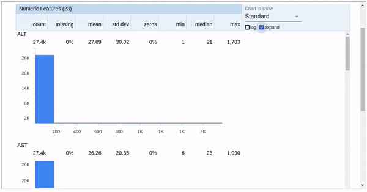
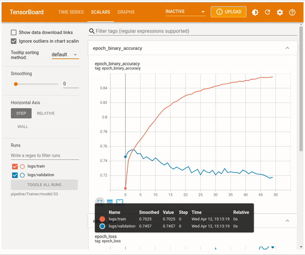

# Smoking Prediction Model
## Dataset Details
Smoking has been proven to negatively affect health in a multitude of ways, and it has been found to harm nearly every organ of the body, causing many diseases and reducing the life expectancy of smokers. As of 2018, smoking has been considered the leading cause of preventable morbidity and mortality in the world, continuing to plague the world’s overall health. According to a World Health Organization report, the number of deaths caused by smoking will reach 10 million by 2030.

Despite the availability of evidence-based treatment for smoking cessation, only less than one third of the participants could achieve the goal of abstinence. Many physicians found counseling for smoking cessation ineffective and time-consuming and did not routinely do so in daily practice. To overcome this problem, several factors had been proposed to identify smokers who had a better chance of quitting. These factors include the level of nicotine dependence, exhaled carbon monoxide (CO) concentration, cigarette amount per day, the age at smoking initiation, previous quit attempts, marital status, emotional distress, temperament and impulsivity scores, and the motivation to stop smoking.

However, individual use of these factors for prediction could lead to conflicting results that were not straightforward enough for the physicians and patients to interpret and apply. Providing a prediction model might be a favorable way to understand the chance of quitting smoking for each individual smoker. Health outcome prediction models had been developed using methods of machine learning over recent years.

A group of scientists is working on predictive models with smoking status as the prediction target. Your task is to help them create a machine learning model to identify the smoking status of an individual using bio-signals.

## Dataset Description
The dataset contains the following variables:

- age: 5-year gap
- height (cm)
- weight (kg)
- waist (cm): Waist circumference length
- eyesight (left)
- eyesight (right)
- hearing (left)
- hearing (right)
- systolic: Blood pressure
- relaxation: Blood pressure
- fasting blood sugar
- Cholesterol: total
- triglyceride
- HDL: cholesterol type
- LDL: cholesterol type
- hemoglobin
- Urine protein
- serum creatinine
- AST: glutamic oxaloacetic transaminase type
- ALT: glutamic oxaloacetic transaminase type
- Gtp: γ-GTP
- dental caries
- smoking

The objective is to predict the smoking status of an individual using bio-signals.

## Keras Neural Networks for Predictions
TFX was used for the construction of the ML pipeline, and the following steps were taken:
- I start with ingesting the data using ExampleGen, which allows creating training and evaluation splits.
- Then, StatisticsGen is used to create statistics of the features available in the dateset:

- After that, SchemaGen is used to create the schema for the data, which is used when predictions are made.
- The ExampleValidator component is used to check for anomalies.
- Later, Transform component is used to transform the features such that the model learning is improved. The feature transformations
can be found in ```smoking_transform.py``` file.
- Finally, the Trainer component is used to train and evaluate the neural netowrk. The Keras model used of training can be found in
the ```smoking_trainer.py``` file.
There were 50 epochs in the model training and here is how the model performed,:


- After the model is trained, it is pushed to "Serve/model" directory using the Pusher component.

### Making Predictions
The served model can be deployed using Docker. Use the following commands to deploy the model using docker:
```
docker pull tensorflow/serving
docker run -p 8501:8501 --mount type=bind,source=/run/media/thakur/SecDisk/CampaignCost/Serve/model/1681308668,target=/models/1 -e MODEL_NAME=1 -t tensorflow/serving
```
Once the model is deployed, you can run the "inference.py" file to make predictions.
