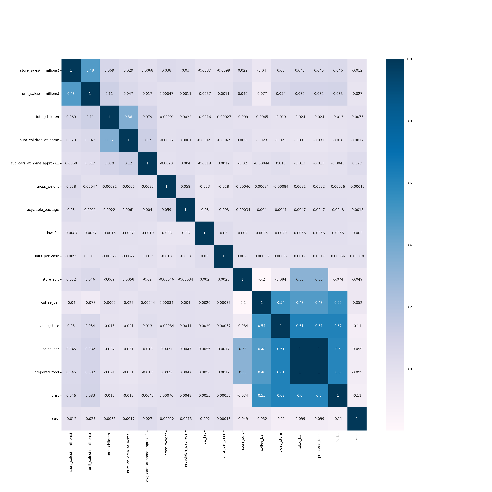
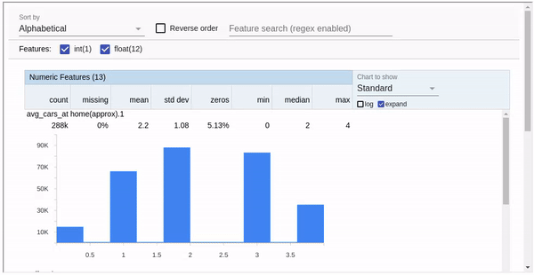
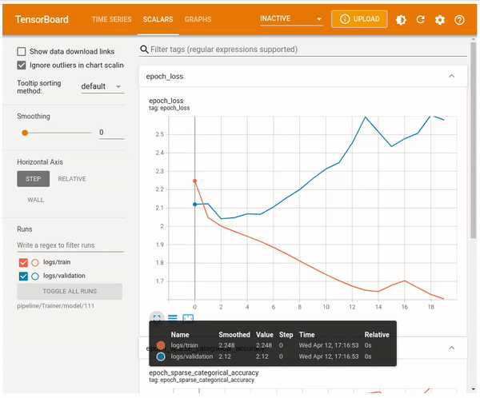

# Food Mart Media Campaign Cost Prediction

Convenient Food Mart (CFM) is a chain of convenience stores in the United States. The private company's headquarters are located in Mentor, Ohio, and currently, approximately 325 stores are located in the US. Convenient Food Mart operates on the franchise system.

Food Mart was the nation's third-largest chain of convenience stores as of 1988. The NASDAQ exchange dropped Convenient Food Mart the same year when the company failed to meet financial reporting requirements. Carden & Cherry advertised Convenient Food Mart with the Ernest character in the 1980s.

Your task is to devise a Machine Learning Model that helps us predict the cost of media campaigns in the food marts on the basis of the features provided.

## Dataset Description:

The dataset consists of the following features:

- store_sales (in millions): Store sales in million dollars.
- unit_sales (in millions): Unit sales in millions in stores Quantity.
- Total_children: Total children in home.
- avg_cars_at_home(approx): Average number of cars at home.
- Num_children_at_home: Number of children at home as per customer-filled details.
- Gross_weight: Gross weight of the item.
- Recyclable_package: Whether the food item is in a recyclable package or not.
- Low_fat: Whether the food item is low-fat or not.
- Units_per_case: Units per case, i.e., the units available in each store shelf.
- Store_sqft: Store area available in square feet.
- Coffee_bar: Whether a coffee bar is available in the store or not.
- Video_store: Whether a video store or gaming store is available in the store or not.
- Salad_bar: Whether a salad bar is available in the store or not.
- Prepared_food: Whether food prepared is available in the store or not.
- Florist: Whether flower shelves are available in the store or not.
- Cost: Cost of acquiring a customer in dollars.

## Keras Neural Networks for Predictions
Before using TFX and relevant components, the feature selection was performed. Three least correlated features from the
following figure were discarded:

TFX was used for the construction of the ML pipeline, and the following steps were taken:
- I start with ingesting the data using ExampleGen, which allows creating training and evaluation splits.
- Then, StatisticsGen is used to create statistics of the features available in the dateset:

- After that, SchemaGen is used to create the schema for the data, which is used when predictions are made.
- The ExampleValidator component is used to check for anomalies.
- Later, Transform component is used to transform the features such that the model learning is improved. The feature transformations
can be found in ```shops_transform.py``` file.
- Finally, the Trainer component is used to train and evaluate the neural netowrk. The Keras model used of training can be found in
the ```shops_trainer.py``` file.
There were 20 epochs in the model training and here is how the model performed,:


- After the model is trained, it is pushed to "Serve/model" directory using the Pusher component.

### Making Predictions
The served model can be deployed using Docker. Use the following commands to deploy the model using docker:
```
docker pull tensorflow/serving
docker run -p 8501:8501 --mount type=bind,source=/path/to/file/Serve/model/1681369043,target=/models/1 -e MODEL_NAME=1 -t tensorflow/serving
```
Once the model is deployed, you can run the "inference.py" file to make predictions.
